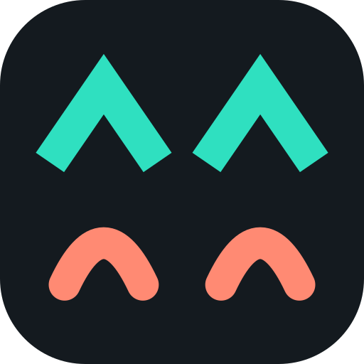

# GladEyes (v8)



GladEyes lets you watch the movies and TV in **your own Plex library** on **Meta Ray-Ban Display** glasses. It is a small
web app: browse your libraries, pick something, and watch it in the glasses' lens. Your Plex server does the heavy
lifting (it converts the video into a small, glasses-friendly stream), so the glasses only receive a light stream.

> **GladEyes is an unofficial, independent project. It is not made by, endorsed by or connected to Plex or Meta.**
> "Plex" is a trademark of Plex, Inc. Meta and Ray-Ban are trademarks of their owners. They are mentioned here only to
> say what this app works with.

**Beta.** It has been tested with one Plex server and one pair of glasses. Please expect rough edges, and see
"Reporting a problem" below.

## What you need

- Meta Ray-Ban Display glasses with **Developer Mode** turned on (Meta's web apps are currently a developer preview;
  the glasses need software v125 or newer and the Meta AI app v272 or newer).
- A **Plex Media Server** with your own movies and TV, and a Plex account.
- **Watching away from home:** turn on **Remote Access** in your Plex server's settings. Plex has said remote streaming
  needs a **Plex Pass** (or a Remote Watch Pass), and that this extends to third-party apps in 2026. If the server's owner
  has a Plex Pass, the people streaming from it don't need their own. At home, none of this applies.

## Adding GladEyes to your glasses

1. In the Meta AI app on your phone: **Settings > App Info**, tap the version number five times, then **Enable** Developer Mode.
2. **App Settings > Apps > Web Apps > Connect Web App**, paste the address of this app (the address of the page you are
   reading this on, for example `https://<name>.github.io/<repo>/`), and **Save**.
3. Open **GladEyes** from the glasses' app grid. The first time, the glasses show a short **code**. On your phone or
   computer go to **plex.tv/link**, sign in to Plex if asked, and enter the code. The glasses carry on by themselves,
   find your server, and remember you for next time. Nothing has to be typed on the glasses.

Use the middle tap on the glasses for the web app menu (**Restart / Resume / Permissions**).

## Using it

- Libraries list, then a list of titles in alphabetical order. A **Back** button is at the top left of every screen: move
  **Up** past the first row, or **Left** past the list's edge, to select it.
- **Big libraries** show a strip of letters (`# A B C ... Z`) above the list. **Right** from anywhere in the list moves to
  the **next letter** and **Left** to the **previous** one (the cursor lands on that letter in the strip; press **Down**
  to go into the list). Each letter shows 100 titles at a time, with a **Show more** row at the end.
- A movie opens a page with its poster, description and a **Play** button. A TV show opens its seasons, then the episodes.
- While playing, **Select** opens the controls: **-15s / Play-Pause / +15s / Exit**. A small **Controls** pill at the bottom
  of the picture is what you select. The line under the progress bar shows how it is playing (method, quality, buffer, stalls).
- Every play starts from the beginning.

**Settings** (bottom of the Libraries screen) shows who is signed in, which server and how you're connected, and has
**Change server**, **Reconnect**, **Diagnostics** and **Sign out**.

## Watching away from home

Each time it opens, GladEyes works out the best way to reach your server, in this order:
1. **Your home network** (fast).
2. **A remote connection**: your server's public address (needs Remote Access turned on).
3. **Plex's relay**: slower, used when a direct remote connection isn't available. The app starts at a lighter quality
   when connected this way.

The Libraries screen says how it connected. If playback keeps stalling (common on mobile data) GladEyes lowers the quality
by itself; the stats line shows what it is using.

## If video won't play, or keeps buffering

The player shows a report listing what was tried and what your server replied. Open **Settings > Diagnostics** straight
after a problem to see a log of what the app was doing. Things to try: lower `videoResolution` and `maxVideoBitrate` in
`config.js` (for example `"426x240"` and `400`), check the movie plays in Plex Web, and check your server isn't struggling to convert
video (Plex Web > Settings > Status > Dashboard shows the transcode speed while playing).

## Privacy

- GladEyes itself collects **nothing**: no analytics, no accounts of its own, no tracking.
- Your Plex sign-in is stored **only on your glasses** (in the browser's local storage). **Sign out** in Settings removes it.
- The app talks to: **plex.tv** (sign-in and finding your server), **your own Plex server**, and, only if needed, a
  public copy of the hls.js video library (unless its file is hosted alongside the app; see below).
- The page itself is hosted on GitHub Pages, which keeps ordinary web logs like any website.

## Reporting a problem

Open **Settings > Diagnostics** straight after it happens and read the **Last session** section. Please include that, your
glasses' software version, and what you pressed.

## Hosting your own copy

Everything is plain HTML, CSS and JavaScript: no build step.

1. Put the files in a GitHub repository (use `git add -A` or GitHub Desktop so the hidden `.nojekyll` file and `.well-known`
   folder are included), then **Settings > Pages > Deploy from a branch > main / (root)**.
2. **Never commit a Plex token.** People sign in with a code, so none is needed. (If you want a launch link with a token:
   `https://<you>.github.io/<repo>/#token=YOUR_TOKEN`.)
3. Put a copy of **hls.js** next to the app for safety: download
   `https://cdn.jsdelivr.net/npm/hls.js@1.5/dist/hls.min.js`, save it as `hls.min.js`, and upload it into the `js` folder.
   Without it the app falls back to that public address, and only when the glasses' own video player can't play the stream.
4. `config.js` has the settings: `serverUrl` (optional starting address, leave `""` for a shared copy), `libraryOrder`,
   the video quality (`videoResolution`, `maxVideoBitrate`, relay values), `strategy`, `hlsEngine` and more.

| Setting | What it does |
|---|---|
| `libraryOrder` | Library names to list first. Every other movie/TV library follows in the server's order. `[]` = server order |
| `playback.videoResolution` / `maxVideoBitrate` | What the server converts to. Default 480x270 @ 600 kbps (small, but good on a 600-pixel display) |
| `playback.relayResolution` / `relayBitrate` | The starting quality when connected through Plex's relay (default 426x240 @ 400) |
| `playback.autoLowerQuality` | Step down automatically after repeated stalls (default on) |
| `playback.strategy` | `"auto"`, `"hls"` or `"mp4"`: which playback methods to try |
| `playback.hlsEngine` | `"auto"` = the browser's own HLS player first, `"hlsjs"` = the hls.js library first |
| `playback.rebufferSeconds` / `rebufferMaxSeconds` | With hls.js: how much to store up after a stall, and the longest to wait |
| `requestTimeoutSeconds` | How long to wait for the server before giving up on one request |

How playback works: the Plex server always does the conversion (`directPlay=0`, video and audio re-encoded to H.264 +
stereo AAC). The app tries, in order, the browser's own HLS player, the hls.js library, then progressive MP4, moving on by
itself if one fails. Playback starts at 0:00; the app steps back to the start if a player begins elsewhere.

## Files

```
index.html                                page shell
config.js                                 settings (no secrets)
js/plex.js                                Plex API: sign-in by code, finding the server, library loading and cache, stream URLs
js/app.js                                 screens, navigation, letter strip, player, settings, diagnostics
js/hls.min.js                             optional: your own copy of hls.js (see above)
css/style.css                             theme
.well-known/meta-wearables-manifest.json  app name + icon for the glasses' app grid
icons/                                    app icon (one-colour, tinted by the glasses), browser icon, logo
LICENSE                                   MIT licence
.nojekyll                                 lets GitHub Pages serve .well-known
```

## Licence

MIT. See `LICENSE`.
